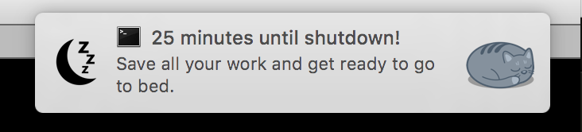

# GOTO SLEEP

### Because sometimes you look out the window and it's already 6am.



## Install

```
git clone https://github.com/ndbroadbent/goto_sleep.git
cd goto_sleep
./install.sh
```

### Details

Notification cron tasks will be set up for the current user,
and a shutdown cron task will be set up for the root user.

The default shutdown time is 3am.
The default warning notifications are at 45 minutes, 25 minutes, and 5 minutes before shutdown.

You can configure these in `config.yml`.

## Uninstall

```
./uninstall.sh
cd ..
rm -rf goto_sleep
```
